# Biểu đồ tuần tự – Use Case: Quản lý Tour & Lịch trình Tour

---

## USE CASE A – Quản lý Tour (Tạo / Sửa / Hủy)

### Tổng quan Use Case A

| Thông tin           | Chi tiết                                                                |
| ------------------- | ----------------------------------------------------------------------- |
| **Tên Use Case**    | Quản lý tour du lịch (CRUD)                                             |
| **Actor**           | Quản lý (người dùng)                                                    |
| **Mục tiêu**        | Tạo mới, cập nhật thông tin, hoặc hủy một tour du lịch                 |
| **Điều kiện trước** | Người dùng đang ở trang danh sách tour hoặc trang chi tiết tour        |
| **Điều kiện sau**   | Tour được lưu / cập nhật / chuyển trạng thái CANCELLED trong database  |

---

### Mã PlantUML – Use Case A

```plantuml
@startuml TourManagement_CRUD

skinparam backgroundColor #F8FAFC
skinparam defaultFontName Arial
skinparam defaultFontSize 11
skinparam sequenceMessageAlign center
skinparam responseMessageBelowArrow true

skinparam participant {
    BackgroundColor #DBEAFE
    BorderColor     #1D4ED8
    FontColor       #1E293B
}
skinparam actor {
    BackgroundColor #FEF3C7
    BorderColor     #D97706
}
skinparam database {
    BackgroundColor #DCFCE7
    BorderColor     #16A34A
}
skinparam note {
    BackgroundColor #FEF9C3
    BorderColor     #D97706
}

actor "Quản lý" as Manager
participant "TourList\n(React)" as TourList
participant "TourForm\n(Modal)" as TourForm
participant "tourApi\n(axios)" as TourApi
participant "TourController" as Controller
participant "TourServiceImpl" as Service
participant "TourRepository" as Repo
database "MySQL" as DB

== Giai đoạn 1A: Tạo tour mới (POST /api/tours) ==

Manager -> TourList : Click "+ Thêm tour"
TourList -> TourList : setEditingTour(null)\nsetShowForm(true)
TourList -> TourForm : render(tour = null)
activate TourForm

Manager -> TourForm : Điền thông tin tour và nhấn "Tạo tour"
TourForm -> TourForm : validate phía client\n(code, name, dest, dates, maxGuests, price)

alt Validation thất bại (FE)
    TourForm -> Manager : Hiển thị lỗi "Vui lòng điền đầy đủ (*)"
else Validation thành công
    TourForm -> TourApi : tourApi.create(payload)
    TourApi -> Controller : POST /api/tours\n[body: TourRequestDTO]
    activate Controller

    Controller -> Service : createTour(request)
    activate Service

    Service -> Repo : existsByCode(code.toUpperCase())
    Repo -> DB : SELECT COUNT(*) FROM tours\nWHERE code = ?
    DB --> Repo : 0 (không trùng)
    Repo --> Service : false

    alt Mã tour đã tồn tại
        Service -> Controller : throw BusinessException\n"Mã tour '...' đã tồn tại"
        Controller --> TourApi : HTTP 400 ApiResponse.error(...)
        TourApi --> TourForm : throw Error(message)
        TourForm -> Manager : Hiển thị lỗi trong form
    else Mã hợp lệ
        Service -> Service : validate endDate >= startDate
        Service -> Service : tính durationDays =\nCHRONO_DAYS(start, end) + 1

        Service -> Repo : save(newTour)
        Repo -> DB : INSERT INTO tours\n(code, name, destination,\nstart_date, end_date,\nduration_days, max_guests,\nprice, status, min_guides, ...)
        DB --> Repo : Tour{id=X, code=...}
        Repo --> Service : Tour (saved)

        Service -> Repo : countActiveAssignmentsByTourId(id)
        DB --> Repo : 0
        Repo --> Service : 0L

        Service -> Service : toSummaryDTO(tour)
        Service --> Controller : TourSummaryDTO
        deactivate Service

        Controller --> TourApi : HTTP 201\nApiResponse<TourSummaryDTO>
        deactivate Controller

        TourApi --> TourForm : res (success)
        TourForm -> TourList : onSuccess()
        deactivate TourForm

        TourList -> TourList : setSuccess("Tạo tour thành công!")
        TourList -> TourApi : tourApi.getAll()
        TourApi -> Controller : GET /api/tours
        Controller --> TourApi : HTTP 200 List<TourSummaryDTO>
        TourApi --> TourList : danh sách tour mới
        TourList -> Manager : Hiển thị danh sách cập nhật\n+ SuccessAlert
    end
end

== Giai đoạn 1B: Sửa tour (PUT /api/tours/{id}) ==

Manager -> TourList : Click "✏️ Sửa" trên TourCard
note right of TourList
  Nút Sửa disabled nếu
  status = COMPLETED hoặc CANCELLED
end note

TourList -> TourList : setEditingTour(tour)\nsetShowForm(true)
TourList -> TourForm : render(tour = existingTour)
activate TourForm

TourForm -> TourForm : useEffect → khởi tạo form\nvới dữ liệu tour hiện tại

Manager -> TourForm : Chỉnh sửa thông tin và nhấn "Cập nhật"
TourForm -> TourForm : validate phía client

TourForm -> TourApi : tourApi.update(tour.id, payload)
TourApi -> Controller : PUT /api/tours/{id}\n[body: TourRequestDTO]
activate Controller

Controller -> Service : updateTour(id, request)
activate Service

Service -> Repo : findById(id)
Repo -> DB : SELECT * FROM tours WHERE id = ?
DB --> Repo : Tour entity
Repo --> Service : Optional<Tour>

alt Tour COMPLETED
    Service -> Controller : throw BusinessException\n"Không thể chỉnh sửa tour đã hoàn thành"
    Controller --> TourApi : HTTP 400
    TourApi --> TourForm : throw Error(message)
    TourForm -> Manager : Hiển thị lỗi trong form
else Tour hợp lệ để sửa
    Service -> Service : kiểm tra code thay đổi?

    alt Code đã đổi & trùng với tour khác
        Service -> Repo : existsByCodeAndIdNot(code, id)
        DB --> Repo : true
        Repo --> Service : true
        Service -> Controller : throw BusinessException\n"Mã tour '...' đã tồn tại"
        Controller --> TourApi : HTTP 400
        TourApi --> TourForm : throw Error(message)
    else Code hợp lệ
        Service -> Service : validate endDate >= startDate
        Service -> Service : tính lại durationDays
        Service -> Service : cập nhật các field của tour entity
        Service -> Repo : save(tour)
        Repo -> DB : UPDATE tours SET code=?, name=?,\ndestination=?, start_date=?, ...\nWHERE id=?
        DB --> Repo : Tour (updated)
        Repo --> Service : Tour (updated)

        Service -> Service : toSummaryDTO(tour)
        Service --> Controller : TourSummaryDTO
        deactivate Service

        Controller --> TourApi : HTTP 200\nApiResponse<TourSummaryDTO>
        deactivate Controller

        TourApi --> TourForm : res (success)
        TourForm -> TourList : onSuccess()
        deactivate TourForm

        TourList -> TourList : setSuccess("Cập nhật tour thành công!")
        TourList -> TourApi : tourApi.getAll()
        TourApi --> TourList : danh sách cập nhật
        TourList -> Manager : Hiển thị danh sách + SuccessAlert
    end
end

== Giai đoạn 1C: Hủy tour (DELETE /api/tours/{id}) ==

Manager -> TourList : Click "🚫 Hủy" trên TourCard
note right of TourList
  Nút Hủy disabled nếu
  status = COMPLETED hoặc CANCELLED
end note

TourList -> Manager : window.confirm("Bạn có chắc muốn hủy tour...?")

alt Người dùng chọn "Hủy" (Cancel)
    Manager -> TourList : Xác nhận hủy
    TourList -> TourApi : tourApi.cancel(tourId)
    TourApi -> Controller : DELETE /api/tours/{id}
    activate Controller

    Controller -> Service : cancelTour(id)
    activate Service

    Service -> Repo : findById(id)
    DB --> Repo : Tour entity
    Repo --> Service : Optional<Tour>

    alt Tour đã CANCELLED
        Service -> Controller : throw BusinessException\n"Tour đã bị hủy trước đó"
        Controller --> TourApi : HTTP 400
        TourApi --> TourList : throw Error(message)
        TourList -> Manager : ErrorAlert (lỗi)
    else Tour đã COMPLETED
        Service -> Controller : throw BusinessException\n"Không thể hủy tour đã hoàn thành"
        Controller --> TourApi : HTTP 400
        TourApi --> TourList : throw Error(message)
        TourList -> Manager : ErrorAlert (lỗi)
    else Tour hợp lệ để hủy
        Service -> Service : tour.setStatus(CANCELLED)
        Service -> Repo : save(tour)
        Repo -> DB : UPDATE tours SET status = 'CANCELLED'\nWHERE id = ?
        DB --> Repo : ok
        Repo --> Service : Tour (status=CANCELLED)
        Service --> Controller : void
        deactivate Service

        Controller --> TourApi : HTTP 200\nApiResponse<Void> "Hủy tour thành công"
        deactivate Controller

        TourApi --> TourList : res (success)
        TourList -> TourList : setSuccess("Đã hủy tour thành công")
        TourList -> TourApi : tourApi.getAll()
        TourApi --> TourList : danh sách cập nhật
        TourList -> Manager : Danh sách cập nhật\n(card tour hiển thị badge "Đã hủy")
    end
else Người dùng chọn "Cancel"
    Manager -> TourList : Không làm gì
end

@enduml
```

---

### Các bước sơ đồ tuần tự – Use Case A

#### Giai đoạn 1A – Tạo tour mới (POST /api/tours)

**1.** Người dùng nhấn nút **"+ Thêm tour"** ở góc trên phải thanh toolbar của `TourList`.

**2.** `TourList` cập nhật state `editingTour = null` và `showForm = true`, render component `TourForm` modal với prop `tour = null`.

**3.** `TourForm` nhận `tour = null`, khởi tạo `form` state với giá trị mặc định: `status = 'PLANNING'`, `minGuides = 1`, các trường còn lại rỗng.

**4.** Người dùng điền đầy đủ thông tin và nhấn **"Tạo tour"**. `handleSubmit()` được gọi.

**5.** `TourForm` kiểm tra validation phía client: các trường bắt buộc (code, name, destination, startDate, endDate, maxGuests, price) không được rỗng; `endDate >= startDate`. Nếu lỗi, hiển thị thông báo lỗi và dừng lại, không gọi API.

**6.** `TourForm` gọi `tourApi.create(payload)`, gửi HTTP `POST /api/tours` với body `TourRequestDTO`.

**7.** `TourController` nhận request, chạy `@Valid` Bean Validation. Nếu lỗi → `GlobalExceptionHandler` trả về HTTP 400. Nếu hợp lệ → gọi `tourService.createTour(request)`.

**8.** `TourServiceImpl.createTour()` chuẩn hóa `code = code.trim().toUpperCase()`, gọi `tourRepository.existsByCode(code)`.

**9.** `TourRepository` thực thi `SELECT COUNT(*) FROM tours WHERE code = ?`.

**10.** Database trả về `0` (không trùng). Nếu trùng (`> 0`) → ném `BusinessException("Mã tour '...' đã tồn tại")` → HTTP 400 → FE hiển thị lỗi.

**11.** `TourServiceImpl` kiểm tra `request.endDate.isBefore(request.startDate)`. Nếu đúng → ném `BusinessException("Ngày kết thúc phải >= ngày bắt đầu")`.

**12.** `TourServiceImpl` tính `durationDays = DAYS.between(startDate, endDate) + 1`.

**13.** `TourServiceImpl` tạo entity `Tour` mới với đầy đủ thông tin, gọi `tourRepository.save(tour)`.

**14.** `TourRepository` thực thi `INSERT INTO tours (code, name, destination, start_date, end_date, duration_days, max_guests, current_guests, price, status, min_guides, ...) VALUES (...)`.

**15.** Database lưu bản ghi và trả về entity `Tour` đã có `id`.

**16.** `TourServiceImpl` gọi `assignmentRepository.countActiveAssignmentsByTourId(id)` → trả về `0`, đóng gói thành `TourSummaryDTO`, trả về cho Controller.

**17.** `TourController` bọc kết quả vào `ApiResponse.ok("Tạo tour thành công", dto)` và trả về **HTTP 201 Created**.

**18.** `tourApi` nhận phản hồi và trả về cho `TourForm`. `handleSubmit()` gọi `onSuccess()` callback.

**19.** `TourList.handleFormSuccess()` đóng modal, hiển thị `SuccessAlert "Tạo tour mới thành công!"`, gọi lại `fetchTours()` để reload danh sách.

---

#### Giai đoạn 1B – Sửa tour (PUT /api/tours/{id})

**20.** Người dùng nhấn nút **"✏️ Sửa"** trên `TourCard` (nút bị disabled nếu tour đang `COMPLETED` hoặc `CANCELLED`).

**21.** `TourList.handleEdit(tour)` cập nhật `editingTour = tour` và `showForm = true`, render `TourForm` với prop `tour = existingTour`.

**22.** `TourForm` nhận `tour` prop, `useEffect` kích hoạt khởi tạo `form` state với dữ liệu hiện tại của tour (code, name, destination, startDate, endDate, ...).

**23.** Người dùng chỉnh sửa và nhấn **"Cập nhật"**. `handleSubmit()` được gọi với validation tương tự bước 5.

**24.** `TourForm` gọi `tourApi.update(tour.id, payload)`, gửi HTTP `PUT /api/tours/{id}` với body `TourRequestDTO`.

**25.** `TourController` nhận request → gọi `tourService.updateTour(id, request)`.

**26.** `TourServiceImpl.updateTour()` gọi `tourRepository.findById(id)`. Nếu không tìm thấy → `ResourceNotFoundException` → HTTP 404.

**27.** Kiểm tra `tour.getStatus() == COMPLETED`. Nếu đúng → ném `BusinessException("Không thể chỉnh sửa tour đã hoàn thành")` → HTTP 400.

**28.** Nếu `code` đã thay đổi, gọi `tourRepository.existsByCodeAndIdNot(newCode, id)` để kiểm tra trùng lặp với tour khác. Nếu trùng → `BusinessException` → HTTP 400.

**29.** Kiểm tra `endDate >= startDate`. Tính lại `durationDays`. Cập nhật tất cả fields của entity tour.

**30.** Gọi `tourRepository.save(tour)` → `UPDATE tours SET ... WHERE id = ?`. Database trả về entity đã cập nhật.

**31.** `TourServiceImpl` trả về `TourSummaryDTO`. `TourController` trả về **HTTP 200**.

**32.** `TourList` đóng modal, hiển thị `SuccessAlert "Cập nhật tour thành công!"`, reload danh sách.

---

#### Giai đoạn 1C – Hủy tour (DELETE /api/tours/{id})

**33.** Người dùng nhấn nút **"🚫 Hủy"** trên `TourCard` hoặc trong `TourDetailPage` (nút disabled nếu tour đã `COMPLETED` hoặc `CANCELLED`).

**34.** `window.confirm("Bạn có chắc muốn hủy tour...?\nHành động này không thể hoàn tác.")` hiển thị. Nếu người dùng chọn **Cancel** → không làm gì.

**35.** Người dùng xác nhận → `handleCancel(tourId, tourName)` gọi `tourApi.cancel(tourId)`, gửi HTTP `DELETE /api/tours/{id}`.

**36.** `TourController` gọi `tourService.cancelTour(id)`.

**37.** `TourServiceImpl.cancelTour()` gọi `tourRepository.findById(id)`. Không tìm thấy → HTTP 404.

**38.** Kiểm tra `status == CANCELLED` → ném `BusinessException("Tour đã bị hủy trước đó")` → HTTP 400.

**39.** Kiểm tra `status == COMPLETED` → ném `BusinessException("Không thể hủy tour đã hoàn thành")` → HTTP 400.

**40.** Gọi `tour.setStatus(TourStatus.CANCELLED)`, gọi `tourRepository.save(tour)` → `UPDATE tours SET status = 'CANCELLED' WHERE id = ?`.

**41.** `TourController` trả về **HTTP 200** `ApiResponse.ok("Hủy tour thành công", null)`.

**42.** FE hiển thị `SuccessAlert`, card tour cập nhật badge **"Đã hủy"**, nút Sửa/Hủy tự động bị disabled.

---

### Luồng thay thế – Use Case A (Lỗi)

| Tình huống                              | Xảy ra tại bước | Kết quả                                                              |
| --------------------------------------- | --------------- | -------------------------------------------------------------------- |
| Trường bắt buộc bỏ trống               | 5, 23           | FE: hiển thị lỗi trong form, không gọi API                          |
| endDate < startDate                     | 5, 11, 29       | FE (bước 5): form lỗi; BE (bước 11, 29): HTTP 400                   |
| Mã tour đã tồn tại                      | 10, 28          | `BusinessException` → HTTP 400 → FE hiển thị trong form             |
| Tour không tồn tại (update/cancel)      | 26, 37          | `ResourceNotFoundException` → HTTP 404 → FE hiện "Không tìm thấy"  |
| Tour đã COMPLETED (update/cancel)       | 27, 39          | `BusinessException` → HTTP 400 → FE hiện thông báo lỗi             |
| Tour đã CANCELLED (cancel lại)          | 38              | `BusinessException` → HTTP 400 → FE hiện "Tour đã bị hủy trước đó" |
| Lỗi hệ thống (DB down, v.v.)            | Bất kỳ          | `Exception` → `GlobalExceptionHandler` → HTTP 500 → FE hiện lỗi    |

---
---

## USE CASE B – Quản lý lịch trình tour (CRUD TourItinerary)

### Tổng quan Use Case B

| Thông tin           | Chi tiết                                                                      |
| ------------------- | ----------------------------------------------------------------------------- |
| **Tên Use Case**    | Quản lý lịch trình tour theo ngày                                             |
| **Actor**           | Quản lý (người dùng)                                                          |
| **Mục tiêu**        | Xem, thêm, sửa, xóa các hoạt động trong lịch trình của một tour              |
| **Điều kiện trước** | Người dùng đang ở trang chi tiết tour (`TourDetailPage`)                      |
| **Điều kiện sau**   | Lịch trình được lưu / cập nhật / xóa; hiển thị đúng thứ tự ngày và thứ tự  |

---

### Mã PlantUML – Use Case B

```plantuml
@startuml TourItinerary_CRUD

skinparam backgroundColor #F8FAFC
skinparam defaultFontName Arial
skinparam defaultFontSize 11
skinparam sequenceMessageAlign center
skinparam responseMessageBelowArrow true

skinparam participant {
    BackgroundColor #DBEAFE
    BorderColor     #1D4ED8
    FontColor       #1E293B
}
skinparam actor {
    BackgroundColor #FEF3C7
    BorderColor     #D97706
}
skinparam database {
    BackgroundColor #DCFCE7
    BorderColor     #16A34A
}
skinparam note {
    BackgroundColor #FEF9C3
    BorderColor     #D97706
}

actor "Quản lý" as Manager
participant "TourDetailPage\n(React)" as DetailPage
participant "ItineraryList\n(React)" as ItList
participant "ItineraryForm\n(Modal)" as ItForm
participant "itineraryApi\n(axios)" as ItApi
participant "TourItineraryController" as Controller
participant "TourItineraryServiceImpl" as Service
participant "TourItineraryRepository" as ItRepo
participant "TourRepository" as TourRepo
database "MySQL" as DB

== Giai đoạn 2A: Xem lịch trình (GET /api/tours/{tourId}/itineraries) ==

Manager -> DetailPage : Truy cập /tours/:id
DetailPage -> DetailPage : render ItineraryList\n(tourId, durationDays, tourStatus)
activate ItList

ItList -> ItList : useEffect → fetchItineraries()
ItList -> ItApi : itineraryApi.getByTour(tourId)
ItApi -> Controller : GET /api/tours/{tourId}/itineraries
activate Controller

Controller -> Service : getByTourId(tourId)
activate Service

Service -> TourRepo : existsById(tourId)
TourRepo -> DB : SELECT COUNT(*) FROM tours WHERE id = ?
DB --> TourRepo : 1
TourRepo --> Service : true

Service -> ItRepo : findByTourIdOrderByDayNumberAscSequenceOrderAsc(tourId)
ItRepo -> DB : SELECT * FROM tour_itineraries\nWHERE tour_id = ?\nORDER BY day_number ASC,\nsequence_order ASC
DB --> ItRepo : List<TourItinerary>
ItRepo --> Service : List<TourItinerary>

Service -> Service : map mỗi TourItinerary → TourItineraryDTO
Service --> Controller : List<TourItineraryDTO>
deactivate Service

Controller --> ItApi : HTTP 200\nApiResponse<List<TourItineraryDTO>>
deactivate Controller

ItApi --> ItList : res.data (danh sách lịch trình)
ItList -> ItList : setItineraries(data)\ngroup by dayNumber\nsort by dayNumber, sequenceOrder
ItList -> Manager : Hiển thị lịch trình theo từng ngày\n(Ngày 1, Ngày 2, ... Ngày N)
deactivate ItList

== Giai đoạn 2B: Thêm hoạt động (POST /api/tours/{tourId}/itineraries) ==

Manager -> ItList : Click "+ Thêm hoạt động"
note right of ItList
  Nút ẩn nếu tour.status
  = COMPLETED hoặc CANCELLED
end note

ItList -> ItList : setEditingItem(null)\nsetShowForm(true)
ItList -> ItForm : render(itinerary = null)
activate ItForm

ItForm -> ItForm : useEffect → khởi tạo form\n(dayNumber=1, sequenceOrder=1,\ncác trường còn lại rỗng)

Manager -> ItForm : Điền thông tin hoạt động\nvà nhấn "Thêm hoạt động"

ItForm -> ItForm : validate phía client\n(title không rỗng,\nstartTime < endTime,\ndayNumber <= durationDays)

alt Validation FE thất bại
    ItForm -> Manager : Hiển thị lỗi trong form
else Validation FE thành công
    ItForm -> ItApi : itineraryApi.create(tourId, payload)
    ItApi -> Controller : POST /api/tours/{tourId}/itineraries\n[body: TourItineraryRequestDTO]
    activate Controller

    Controller -> Service : create(tourId, request)
    activate Service

    Service -> TourRepo : findById(tourId)
    TourRepo -> DB : SELECT * FROM tours WHERE id = ?
    DB --> TourRepo : Tour entity
    TourRepo --> Service : Optional<Tour>

    Service -> Service : validateTourEditable(tour)
    note right of Service
      Ném BusinessException nếu:
      status = COMPLETED → "đã hoàn thành"
      status = CANCELLED → "đã bị hủy"
    end note

    Service -> Service : validateDayNumber(request.dayNumber,\ntour.durationDays)
    note right of Service
      Ném BusinessException nếu:
      dayNumber > durationDays
    end note

    Service -> Service : validateTime(request)
    note right of Service
      Ném BusinessException nếu:
      startTime != null && endTime != null
      && startTime >= endTime
    end note

    Service -> ItRepo : save(newItinerary)
    ItRepo -> DB : INSERT INTO tour_itineraries\n(tour_id, day_number, sequence_order,\ntitle, description, location,\nstart_time, end_time,\nactivity_type, note, is_optional)
    DB --> ItRepo : TourItinerary{id=X, ...}
    ItRepo --> Service : TourItinerary (saved)

    Service -> Service : toDTO(saved)
    Service --> Controller : TourItineraryDTO
    deactivate Service

    Controller --> ItApi : HTTP 201\nApiResponse<TourItineraryDTO>
    deactivate Controller

    ItApi --> ItForm : res (success)
    ItForm -> ItList : onSuccess()
    deactivate ItForm

    ItList -> ItApi : itineraryApi.getByTour(tourId)
    ItApi --> ItList : danh sách lịch trình cập nhật
    ItList -> Manager : Lịch trình mới xuất hiện\nở đúng Ngày và thứ tự
end

== Giai đoạn 2C: Sửa hoạt động (PUT /api/tours/{tourId}/itineraries/{id}) ==

Manager -> ItList : Click "Sửa" trên một hoạt động
ItList -> ItList : setEditingItem(item)\nsetShowForm(true)
ItList -> ItForm : render(itinerary = existingItem)
activate ItForm

ItForm -> ItForm : useEffect → khởi tạo form\nvới dữ liệu hoạt động hiện tại

Manager -> ItForm : Chỉnh sửa và nhấn "Cập nhật"
ItForm -> ItForm : validate phía client

ItForm -> ItApi : itineraryApi.update(tourId,\nitinerary.id, payload)
ItApi -> Controller : PUT /api/tours/{tourId}/itineraries/{id}\n[body: TourItineraryRequestDTO]
activate Controller

Controller -> Service : update(tourId, itemId, request)
activate Service

Service -> TourRepo : findById(tourId)
DB --> TourRepo : Tour
TourRepo --> Service : Tour

Service -> Service : validateTourEditable(tour)

Service -> ItRepo : findById(itemId)
ItRepo -> DB : SELECT * FROM tour_itineraries\nWHERE id = ?
DB --> ItRepo : TourItinerary
ItRepo --> Service : Optional<TourItinerary>

Service -> Service : kiểm tra itinerary.tour.id == tourId
note right of Service
  Nếu không khớp → throw
  BusinessException("Lịch trình không thuộc tour này")
end note

Service -> Service : validateDayNumber(dayNumber, durationDays)
Service -> Service : validateTime(request)

Service -> Service : cập nhật tất cả fields\ncủa itinerary entity

Service -> ItRepo : save(itinerary)
ItRepo -> DB : UPDATE tour_itineraries\nSET day_number=?, sequence_order=?,\ntitle=?, description=?, ...\nWHERE id=?
DB --> ItRepo : TourItinerary (updated)
ItRepo --> Service : TourItinerary (updated)

Service -> Service : toDTO(updated)
Service --> Controller : TourItineraryDTO
deactivate Service

Controller --> ItApi : HTTP 200\nApiResponse<TourItineraryDTO>
deactivate Controller

ItApi --> ItForm : res (success)
ItForm -> ItList : onSuccess()
deactivate ItForm

ItList -> ItApi : itineraryApi.getByTour(tourId)
ItApi --> ItList : danh sách cập nhật
ItList -> Manager : Lịch trình đã cập nhật\nhiển thị đúng vị trí mới

== Giai đoạn 2D: Xóa hoạt động (DELETE /api/tours/{tourId}/itineraries/{id}) ==

Manager -> ItList : Click "Xóa" trên một hoạt động
ItList -> Manager : window.confirm("Bạn có chắc muốn xóa\nhoạt động '...'?")

alt Người dùng xác nhận
    ItList -> ItApi : itineraryApi.delete(tourId, item.id)
    ItApi -> Controller : DELETE /api/tours/{tourId}/itineraries/{id}
    activate Controller

    Controller -> Service : delete(tourId, itemId)
    activate Service

    Service -> TourRepo : findById(tourId)
    TourRepo -> DB : SELECT * FROM tours WHERE id = ?
    DB --> TourRepo : Tour
    TourRepo --> Service : Tour

    Service -> Service : validateTourEditable(tour)

    Service -> ItRepo : findById(itemId)
    ItRepo -> DB : SELECT * FROM tour_itineraries WHERE id = ?
    DB --> ItRepo : TourItinerary
    ItRepo --> Service : Optional<TourItinerary>

    Service -> Service : kiểm tra itinerary.tour.id == tourId

    Service -> ItRepo : delete(itinerary)
    ItRepo -> DB : DELETE FROM tour_itineraries WHERE id = ?
    DB --> ItRepo : ok

    Service --> Controller : void
    deactivate Service

    Controller --> ItApi : HTTP 200\nApiResponse<Void> "Xóa lịch trình thành công"
    deactivate Controller

    ItApi --> ItList : res (success)
    ItList -> ItApi : itineraryApi.getByTour(tourId)
    ItApi --> ItList : danh sách đã bỏ item xóa
    ItList -> Manager : Lịch trình được cập nhật\n(hoạt động đã xóa biến mất)
else Người dùng hủy
    ItList -> Manager : Không làm gì
end

@enduml
```

---

### Các bước sơ đồ tuần tự – Use Case B

#### Giai đoạn 2A – Xem lịch trình tour

**1.** Người dùng truy cập trang chi tiết tour tại `/tours/:id`. `TourDetailPage` được render.

**2.** Trong `TourDetailPage`, component `ItineraryList` được render ở cuối trang, nhận các props: `tourId`, `durationDays`, `tourStatus`.

**3.** `ItineraryList` kích hoạt `useEffect` → gọi `fetchItineraries()` ngay khi mount.

**4.** `fetchItineraries()` gọi `itineraryApi.getByTour(tourId)`, gửi HTTP `GET /api/tours/{tourId}/itineraries` lên server.

**5.** `TourItineraryController` nhận request, gọi `itineraryService.getByTourId(tourId)`.

**6.** `TourItineraryServiceImpl.getByTourId()` gọi `tourRepository.existsById(tourId)`. Nếu không tồn tại → `ResourceNotFoundException` → HTTP 404.

**7.** Gọi `itineraryRepository.findByTourIdOrderByDayNumberAscSequenceOrderAsc(tourId)`.

**8.** `TourItineraryRepository` thực thi `SELECT * FROM tour_itineraries WHERE tour_id = ? ORDER BY day_number ASC, sequence_order ASC`.

**9.** Database trả về danh sách `TourItinerary` đã sắp xếp.

**10.** `TourItineraryServiceImpl` map từng entity thành `TourItineraryDTO` (gọi `toDTO()`), trả về `List<TourItineraryDTO>`.

**11.** `TourItineraryController` bọc kết quả vào `ApiResponse.ok(...)`, trả về HTTP 200.

**12.** `ItineraryList` cập nhật state `itineraries`, nhóm theo `dayNumber` (group by), render từng nhóm ngày dưới dạng section riêng biệt (header "📆 Ngày 1", "📆 Ngày 2", ...) với danh sách hoạt động bên trong.

**13.** Nếu tour đang ở trạng thái `COMPLETED` hoặc `CANCELLED`, component hiển thị banner thông báo khóa và ẩn toàn bộ nút Thêm/Sửa/Xóa.

---

#### Giai đoạn 2B – Thêm hoạt động vào lịch trình

**14.** Người dùng nhấn nút **"+ Thêm hoạt động"** (nút bị ẩn hoàn toàn nếu tour đã `COMPLETED` hoặc `CANCELLED`).

**15.** `ItineraryList` cập nhật `editingItem = null`, `showForm = true`, render `ItineraryForm` modal.

**16.** `ItineraryForm` nhận `itinerary = null`, khởi tạo `form` state mặc định: `dayNumber = 1`, `sequenceOrder = 1`, các trường còn lại rỗng.

**17.** Dropdown **"Ngày"** tự động render `durationDays` lựa chọn từ 1 đến N.

**18.** Người dùng chọn ngày, nhập thứ tự, tiêu đề, địa điểm, giờ, loại hoạt động, ... và nhấn **"Thêm hoạt động"**.

**19.** `handleSubmit()` thực hiện validation phía client: `title` không rỗng; nếu có cả `startTime` và `endTime` thì `startTime < endTime`; `dayNumber <= durationDays`.

**20.** Nếu validation thành công, gọi `itineraryApi.create(tourId, payload)`, gửi HTTP `POST /api/tours/{tourId}/itineraries` với body `TourItineraryRequestDTO`.

**21.** `TourItineraryController` nhận request, kiểm tra `@Valid` Bean Validation trên các trường `@NotNull`, `@NotBlank`, `@Min`. Nếu lỗi → HTTP 400.

**22.** Gọi `itineraryService.create(tourId, request)`.

**23.** `TourItineraryServiceImpl.create()` gọi `tourRepository.findById(tourId)`. Không tồn tại → HTTP 404.

**24.** Gọi `validateTourEditable(tour)`:
  - `status == COMPLETED` → ném `BusinessException("Không thể thêm lịch trình của tour đã hoàn thành")` → HTTP 400.
  - `status == CANCELLED` → ném `BusinessException("Không thể thêm lịch trình của tour đã bị hủy")` → HTTP 400.

**25.** Gọi `validateDayNumber(request.dayNumber, tour.durationDays)`: nếu `dayNumber > durationDays` → ném `BusinessException("Ngày X vượt quá số ngày của tour (Y ngày)")` → HTTP 400.

**26.** Gọi `validateTime(request)`: nếu cả `startTime` và `endTime` đều không null và `startTime >= endTime` → ném `BusinessException("Giờ bắt đầu phải trước giờ kết thúc")` → HTTP 400.

**27.** Tạo entity `TourItinerary` mới với đầy đủ fields, gọi `itineraryRepository.save(itinerary)`.

**28.** `TourItineraryRepository` thực thi `INSERT INTO tour_itineraries (tour_id, day_number, sequence_order, title, description, location, start_time, end_time, activity_type, note, is_optional) VALUES (...)`.

**29.** Database trả về entity đã có `id`. `TourItineraryServiceImpl` gọi `toDTO()`, trả về `TourItineraryDTO`.

**30.** `TourItineraryController` trả về **HTTP 201 Created** kèm DTO.

**31.** `ItineraryForm` nhận phản hồi thành công, gọi `onSuccess()`. `ItineraryList` đóng modal, gọi lại `fetchItineraries()` để hiển thị hoạt động mới đã được sắp xếp đúng vị trí.

---

#### Giai đoạn 2C – Sửa hoạt động

**32.** Người dùng nhấn nút **"Sửa"** bên cạnh một hoạt động trong lịch trình.

**33.** `ItineraryList` cập nhật `editingItem = item`, `showForm = true`, render `ItineraryForm` với prop `itinerary = existingItem`.

**34.** `ItineraryForm` nhận `itinerary` prop, `useEffect` khởi tạo `form` state với dữ liệu hiện tại của hoạt động.

**35.** Người dùng chỉnh sửa và nhấn **"Cập nhật"**. Validation phía client tương tự bước 19.

**36.** Gọi `itineraryApi.update(tourId, itinerary.id, payload)`, gửi HTTP `PUT /api/tours/{tourId}/itineraries/{id}`.

**37.** `TourItineraryServiceImpl.update()` thực hiện tuần tự: tìm tour → validateTourEditable → tìm itinerary → kiểm tra `itinerary.tour.id == tourId` (nếu không khớp → `BusinessException("Lịch trình không thuộc tour này")`) → validateDayNumber → validateTime.

**38.** Cập nhật tất cả fields của entity, gọi `itineraryRepository.save()` → `UPDATE tour_itineraries SET ... WHERE id = ?`.

**39.** Database trả về entity đã cập nhật. `TourItineraryServiceImpl` trả về `TourItineraryDTO`. `TourItineraryController` trả về **HTTP 200**.

**40.** `ItineraryList` đóng modal, gọi lại `fetchItineraries()` → danh sách hiển thị hoạt động đã được cập nhật ở đúng vị trí ngày và thứ tự mới.

---

#### Giai đoạn 2D – Xóa hoạt động

**41.** Người dùng nhấn nút **"Xóa"** bên cạnh một hoạt động. `window.confirm("Bạn có chắc muốn xóa hoạt động '...'?")` hiển thị.

**42.** Người dùng hủy → không làm gì. Người dùng xác nhận → `handleDelete(item)` gọi `itineraryApi.delete(tourId, item.id)`, gửi HTTP `DELETE /api/tours/{tourId}/itineraries/{id}`.

**43.** `TourItineraryServiceImpl.delete()`: tìm tour → validateTourEditable → tìm itinerary → kiểm tra `itinerary.tour.id == tourId` → gọi `itineraryRepository.delete(itinerary)`.

**44.** `TourItineraryRepository` thực thi `DELETE FROM tour_itineraries WHERE id = ?`.

**45.** `TourItineraryController` trả về **HTTP 200** `ApiResponse.ok("Xóa lịch trình thành công", null)`.

**46.** `ItineraryList` gọi lại `fetchItineraries()`. Hoạt động đã xóa biến mất khỏi danh sách. Nếu một ngày không còn hoạt động nào, section header của ngày đó cũng biến mất.

---

### Luồng thay thế – Use Case B (Lỗi)

| Tình huống                                  | Xảy ra tại bước | Kết quả                                                                   |
| ------------------------------------------- | --------------- | ------------------------------------------------------------------------- |
| Tour không tồn tại                          | 6, 23, 37, 43   | `ResourceNotFoundException` → HTTP 404 → FE hiện lỗi                     |
| Tour đã COMPLETED hoặc CANCELLED            | 24, 37, 43      | `BusinessException` → HTTP 400 → FE hiển thị lỗi trong form / alert      |
| dayNumber > durationDays                    | 19 (FE), 25 (BE)| FE: lỗi form; BE: `BusinessException` → HTTP 400                         |
| startTime >= endTime                        | 19 (FE), 26 (BE)| FE: lỗi form; BE: `BusinessException` → HTTP 400                         |
| Itinerary không thuộc tour này              | 37, 43          | `BusinessException("Lịch trình không thuộc tour này")` → HTTP 400        |
| Itinerary không tồn tại                     | 37, 43          | `ResourceNotFoundException("Lịch trình", id)` → HTTP 404                  |
| title bỏ trống                              | 19 (FE), @Valid (BE) | FE: hiện lỗi form; BE: MethodArgumentNotValidException → HTTP 400    |
| Lỗi hệ thống (DB down, v.v.)               | Bất kỳ          | `Exception` → `GlobalExceptionHandler` → HTTP 500 → FE hiện "Lỗi hệ thống" |
